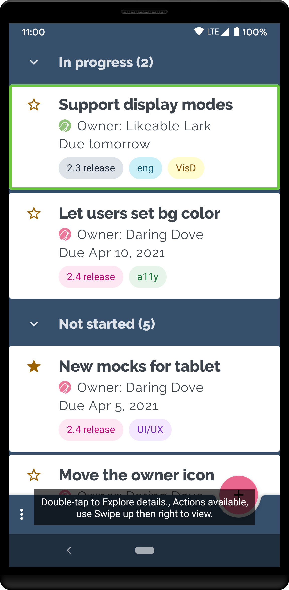
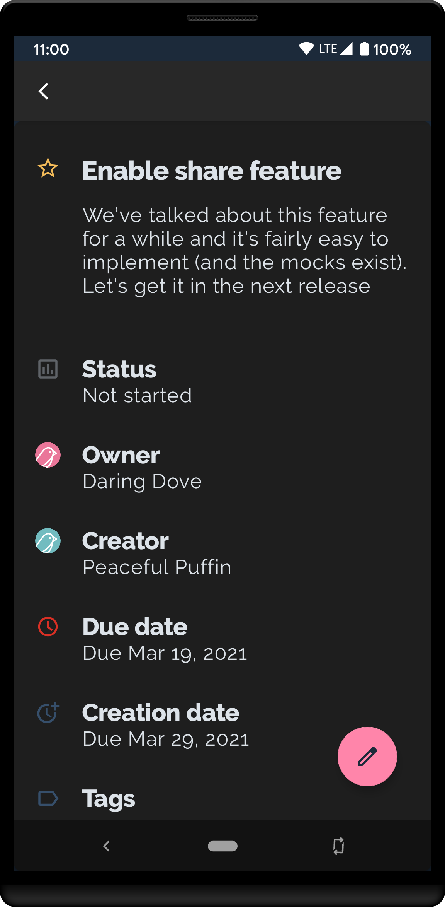
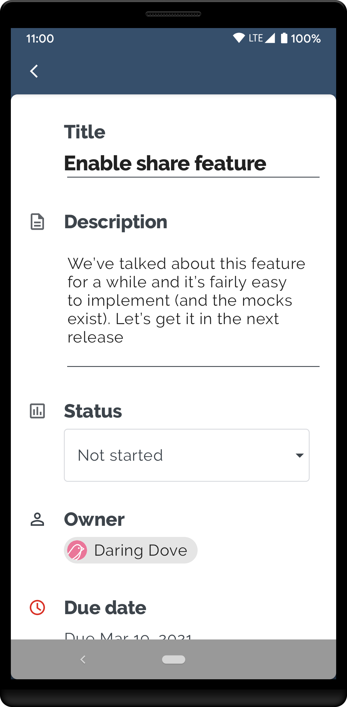

Trackr Android App
==================

Trackr is a sample task management app used to explore common UI patterns
from the perspective of supporting accessibility. Trackr is currently under
development.

Using Trackr, end users can discover, create, and edit tasks; they can
assign tasks to team members and they can associate different tags with
each task.  Users can archive a task by swiping right and they can modify a
task's priority by dragging it up or down.

Developers are encouraged to explore Trackr using an accessibility service
like [Talkback](https://support.google.com/accessibility/android/answer/6283677?hl=en) or
[Switch Access](https://support.google.com/accessibility/android/answer/6122836?hl=en);
developers are also encouraged to try out the various accessibility settings
found on their devices (see Settings > Accessibility on most Android phones)
when using Trackr. If you have any suggestions, please create an issue
(see below).

Trackr is designed with the goal of allowing all users to enjoy its core
functionality, including users with disabilities who may interact with their
devices using accessibility services. So, for example, while blind and low
vision users or users with manual dexterity issues may not be able to perform
the swipe gesture to archive an item or drag and drop items to reorder their
priority, they should nonetheless be able to access the archive and reorder
functionality through the accessibility service they are using.

APIs showcased
---------------------------
The following accessibility APIs (non exhaustive list) are showcased in this sample:

[ViewCompat#addAccessibilityAction()](https://developer.android.com/reference/androidx/core/view/ViewCompat#addAccessibilityAction(android.view.View,%20java.lang.CharSequence,%20androidx.core.view.accessibility.AccessibilityViewCommand)): to surface functionality like swipe-to-archive, drag and drop, etc.

[ViewCompat#performAccessiblityAction()](https://developer.android.com/reference/androidx/core/view/ViewCompat#performAccessibilityAction(android.view.View,%20int,%20android.os.Bundle)): used in testing.

[ViewCompat#replaceAccessibilityAction()](https://developer.android.com/reference/androidx/core/view/ViewCompat#replaceAccessibilityAction(android.view.View,%20androidx.core.view.accessibility.AccessibilityNodeInfoCompat.AccessibilityActionCompat,%20java.lang.CharSequence,%20androidx.core.view.accessibility.AccessibilityViewCommand)): used to customize the label for associated with an action.

[ViewCompat.setStateDescription()](https://developer.android.com/reference/androidx/core/view/ViewCompat#setStateDescription(android.view.View,%20java.lang.CharSequence)): used to specify state associated with a view.

[AccessibilityManager#getRecommendedTimeoutMillis()](https://developer.android.com/reference/android/view/accessibility/AccessibilityManager#getRecommendedTimeoutMillis(int,%20int)): used to specify the timeout for ephemeral content.

Getting Started
-------------------------

This project uses the Gradle build system. To build this project, use the
`gradlew build` command or use "Import Project" in Android Studio.

To run tests, run `gradlew test`

To learn more about Android accessibility, visit the
[Android accessibility](https://www.android.com/accessibility/) page. To learn
more about developer facing aspects of Android accessibility, read the
[accessibility developer guide](https://developer.android.com/guide/topics/ui/accessibility).

Screenshots
-----------

{width=240px}
{width=240px}
{width=240px}

Issues
-----------

We are continuously working to improve this sample and add new features. If
you have suggestions for improvement or if you encounter a problem, please
provide feedback to us via the issue tracker. When creating an issue, try to
include the following:

- The device manufacturer and model
- The Android build running on the device
- If using an accessibility service (for example a screen reader), the name
and version number of that service
- A description of the issue; include screenshots/screencaps if you think
they'll help us understand the problem

License
-------------

Copyright 2021 Google, Inc.

Licensed to the Apache Software Foundation (ASF) under one or more contributor
license agreements.  See the NOTICE file distributed with this work for
additional information regarding copyright ownership.  The ASF licenses this
file to you under the Apache License, Version 2.0 (the "License"); you may not
use this file except in compliance with the License.  You may obtain a copy of
the License at

 http://www.apache.org/licenses/LICENSE-2.0

Unless required by applicable law or agreed to in writing, software
distributed under the License is distributed on an "AS IS" BASIS, WITHOUT
WARRANTIES OR CONDITIONS OF ANY KIND, either express or implied.  See the
License for the specific language governing permissions and limitations under
the License.

